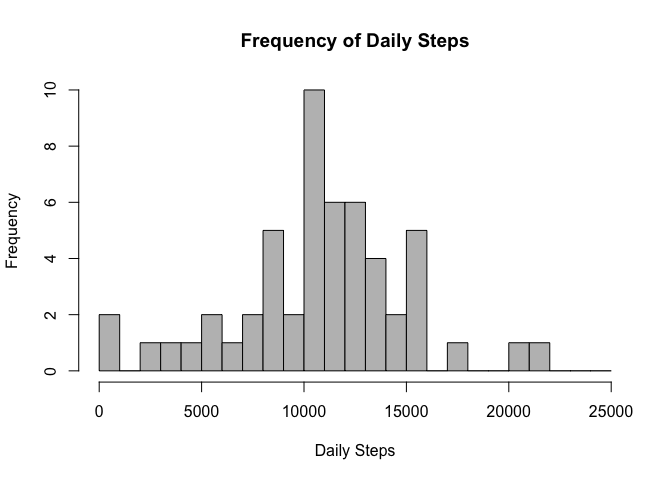

# Reproducible Research: Peer Assessment 1


## Loading and preprocessing the data

```r
install.packages("plyr", repos = "http://had.co.nz/plyr")
```

```
## Warning: unable to access index for repository
## http://had.co.nz/plyr/bin/macosx/mavericks/contrib/3.1
```

```
## Warning: package 'plyr' is not available (for R version 3.1.2)
```

```r
library(plyr)
```

```
## Warning: package 'plyr' was built under R version 3.1.3
```

```r
unzip("activity.zip")
data <- read.csv("activity.csv", header = T)
summary(data)
```

```
##      steps                date          interval     
##  Min.   :  0.00   2012-10-01:  288   Min.   :   0.0  
##  1st Qu.:  0.00   2012-10-02:  288   1st Qu.: 588.8  
##  Median :  0.00   2012-10-03:  288   Median :1177.5  
##  Mean   : 37.38   2012-10-04:  288   Mean   :1177.5  
##  3rd Qu.: 12.00   2012-10-05:  288   3rd Qu.:1766.2  
##  Max.   :806.00   2012-10-06:  288   Max.   :2355.0  
##  NA's   :2304     (Other)   :15840
```


## What is mean total number of steps taken per day?
For this part of the assignment, you can ignore the missing values in the dataset.

1. Calculate the total number of steps taken per day

```r
dailySteps <- ddply(data, ~date, summarize, steps=sum(steps, na.rm=F))
```

2. If you do not understand the difference between a histogram and a barplot, research the difference between them. Make a histogram of the total number of steps taken each day

```r
hist(dailySteps$steps, breaks = seq(0,25000,by=1000), 
     main = "Frequency of Daily Steps", xlab = "Daily Steps", col = "grey")
```

 

3. Calculate and report the mean and median of the total number of steps taken per day

```r
median(dailySteps$steps, na.rm=T)
```

```
## [1] 10765
```

```r
mean(dailySteps$steps, na.rm=T)
```

```
## [1] 10766.19
```

## What is the average daily activity pattern?


## Imputing missing values


## Are there differences in activity patterns between weekdays and weekends?
