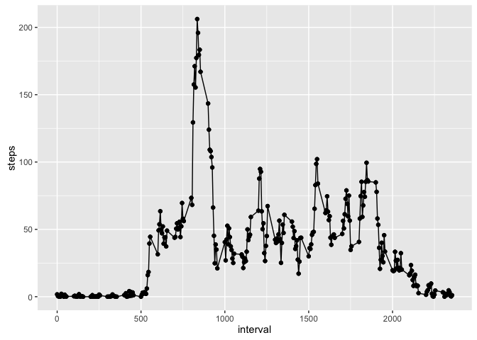

# Reproducible Research: Peer Assessment 1


## Loading and preprocessing the data

```r
install.packages( "plyr", repos = "http://had.co.nz/plyr" )
```

```
## Warning: unable to access index for repository
## http://had.co.nz/plyr/bin/macosx/mavericks/contrib/3.1
```

```
## Warning: package 'plyr' is not available (for R version 3.1.2)
```

```r
library( plyr )
```

```
## Warning: package 'plyr' was built under R version 3.1.3
```

```r
install.packages( "ggplot2", repos = "https://github.com/hadley/ggplot2" )
```

```
## Warning: unable to access index for repository
## https://github.com/hadley/ggplot2/bin/macosx/mavericks/contrib/3.1
```

```
## Warning: package 'ggplot2' is not available (for R version 3.1.2)
```

```r
library( ggplot2 )
```

```
## Warning: package 'ggplot2' was built under R version 3.1.3
```

```r
unzip( "activity.zip" )
data <- read.csv( "activity.csv", header = T )
summary( data )
```

```
##      steps                date          interval     
##  Min.   :  0.00   2012-10-01:  288   Min.   :   0.0  
##  1st Qu.:  0.00   2012-10-02:  288   1st Qu.: 588.8  
##  Median :  0.00   2012-10-03:  288   Median :1177.5  
##  Mean   : 37.38   2012-10-04:  288   Mean   :1177.5  
##  3rd Qu.: 12.00   2012-10-05:  288   3rd Qu.:1766.2  
##  Max.   :806.00   2012-10-06:  288   Max.   :2355.0  
##  NA's   :2304     (Other)   :15840
```


## What is mean total number of steps taken per day?
For this part of the assignment, you can ignore the missing values in the dataset.

1. Calculate the total number of steps taken per day

```r
daily.steps <- ddply( data, ~date, summarize, steps = sum( steps, na.rm = T ))
```

2. If you do not understand the difference between a histogram and a barplot, research the difference between them. Make a histogram of the total number of steps taken each day

```r
hist( daily.steps$steps, breaks = seq( 0, 25000, by = 1000 ), 
     main = "Frequency of Daily Steps", xlab = "Daily Steps", col = "grey" )
```

 

3. Calculate and report the mean and median of the total number of steps taken per day

```r
median( daily.steps$steps, na.rm = T )
```

```
## [1] 10395
```

```r
mean( daily.steps$steps, na.rm = T )
```

```
## [1] 9354.23
```

## What is the average daily activity pattern?
1. Make a time series plot (i.e. 𝚝𝚢𝚙𝚎 = "𝚕") of the 5-minute interval (x-axis) and the average number of steps taken, averaged across all days (y-axis)

```r
interval.steps <- ddply( data, ~interval, summarize, steps = mean( steps, na.rm = T ))
i <- qplot( interval, steps, data = interval.steps )
i + geom_line() + geom_point()
```

 

2. Which 5-minute interval, on average across all the days in the dataset, contains the maximum number of steps?

```r
interval.steps[ which( interval.steps$steps == with( interval.steps, max( steps ))), "interval" ]
```

```
## [1] 835
```


## Imputing missing values
Note that there are a number of days/intervals where there are missing values (coded as 𝙽𝙰). The presence of missing days may introduce bias into some calculations or summaries of the data.

1. Calculate and report the total number of missing values in the dataset (i.e. the total number of rows with 𝙽𝙰s)

```r
na.rows <- is.na( data[ ,"steps" ])
length( subset( na.rows, na.rows == TRUE ))
```

```
## [1] 2304
```

2. Devise a strategy for filling in all of the missing values in the dataset. The strategy does not need to be sophisticated. For example, you could use the mean/median for that day, or the mean for that 5-minute interval, etc.
3. Create a new dataset that is equal to the original dataset but with the missing data filled in.


```r
## Converts interval into look-up index to avoid a for loop to scan intervalSteps for interval mean
int.index <- function( x ){
   m <- x %% 100
   h <- x - m
   i <- ( h / 100 * 12 ) + ( m / 5 + 1 )
   return( i )
}

## Create another instance of dataset to fill in with non-null values
data.filled <- data

## Scans index of na.rows to find NULL values and inputs mean value for that interval
for ( i in 1:length( na.rows )) {
   if( na.rows[ i ] == TRUE )
      data.filled[ i, "steps" ] <- interval.steps[ int.index( data[ i, "interval"]), "steps" ]
}
```

4. Make a histogram of the total number of steps taken each day and Calculate and report the mean and median total number of steps taken per day. Do these values differ from the estimates from the first part of the assignment? What is the impact of imputing missing data on the estimates of the total daily number of steps?

```r
daily.steps.filled <- ddply( data.filled, ~date, summarize, steps = sum( steps ))

hist( daily.steps.filled$steps, breaks = seq( 0, 25000, by = 1000 ), 
     main = "Frequency of Daily Steps (non-empty values)", xlab = "Daily Steps", col = "grey" )
```

 

```r
median( daily.steps.filled$steps, na.rm = F )
```

```
## [1] 10766.19
```

```r
mean( daily.steps.filled$steps, na.rm = F )
```

```
## [1] 10766.19
```
Estimating missing values pulls the mean and median values to the right. With missing values, there is a high frequency of dates with 0 steps taken that day. After filling in the missing values, these zero values are replaced with estimates, which can be observed in the second histrogram. The highest frequency of daily steps is between 10,000 and 11,00. 


## Are there differences in activity patterns between weekdays and weekends?
